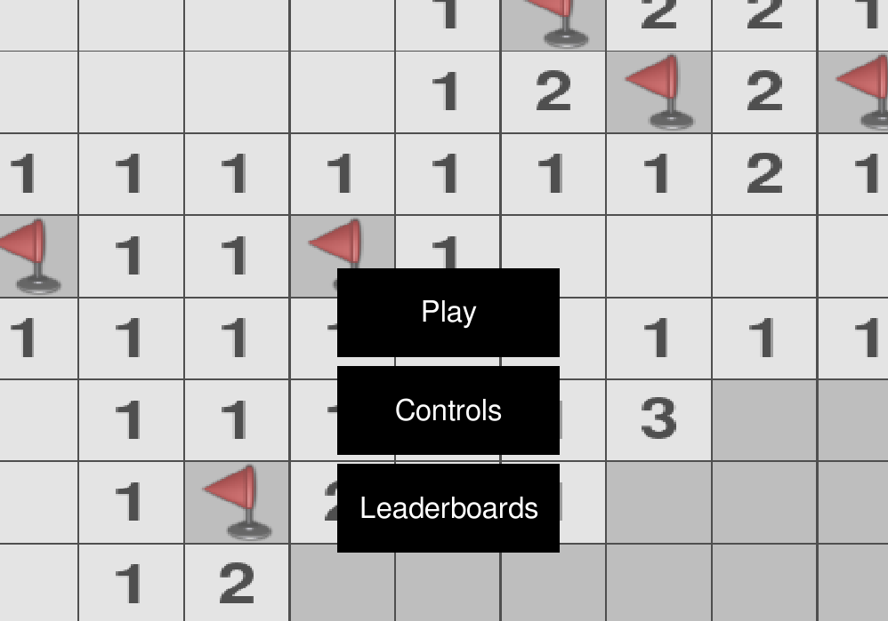
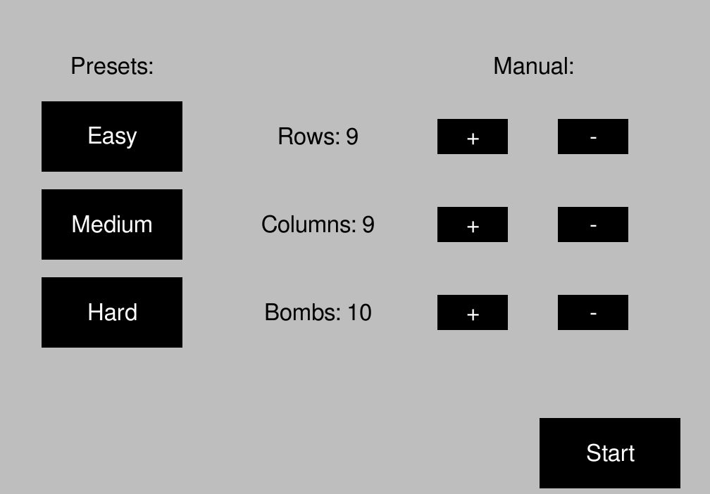
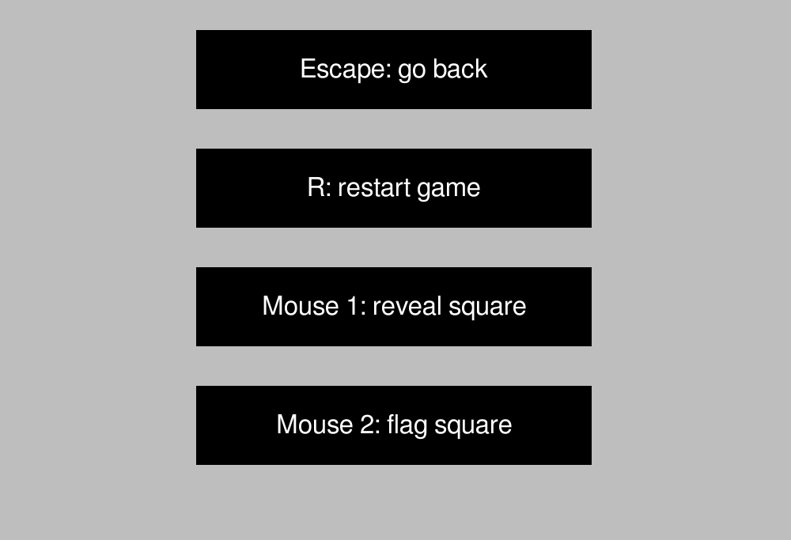
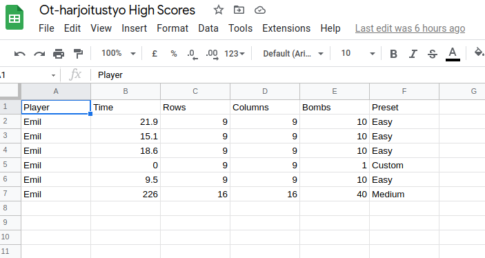
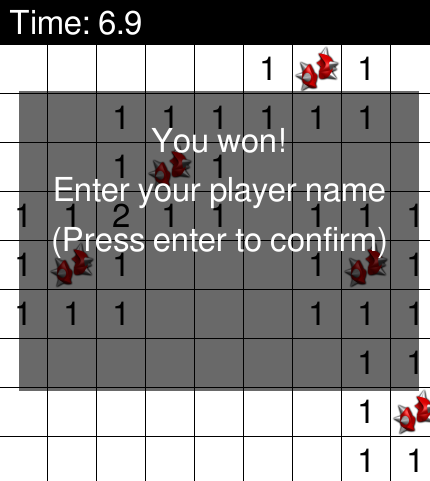

# Käyttöohje
Lataa projekti release sivulta. Lataa source code zip tiedosto.

## Ohjelman käynnistäminens
Riippuvuudet asennetaan komennolla:
```bash
poetry install
```

Sovelluksen voi tämän jälkeen  käynnistää komennolla:
```bash
poetry run invoke start
``` 

## Pelaaminen
Sovellus käynnistyy main menu näkymään:



Tästä näkymästä voi siirtyä play napin kautta näkymään, jossa valitaan miinaharavakentän dimensiot



Kun on valinnut dimensiot miinaharvapeli aloitetaan start napilla. Peli avautuu uuteen ikkunaan.

Menu näkymästä pääsee myös näkymään, jossa kerrotaan pelin säätimet



Lopuksi voi painaa leaderboards nappia ja päästä pelin high score listalle, joka sijaitsee google sheetsissä.



Kun voittaa pelin, niin pelaajalla on mahdollisuus antaa nimensä ja lähettää aikansa google sheets leaderboardsille


