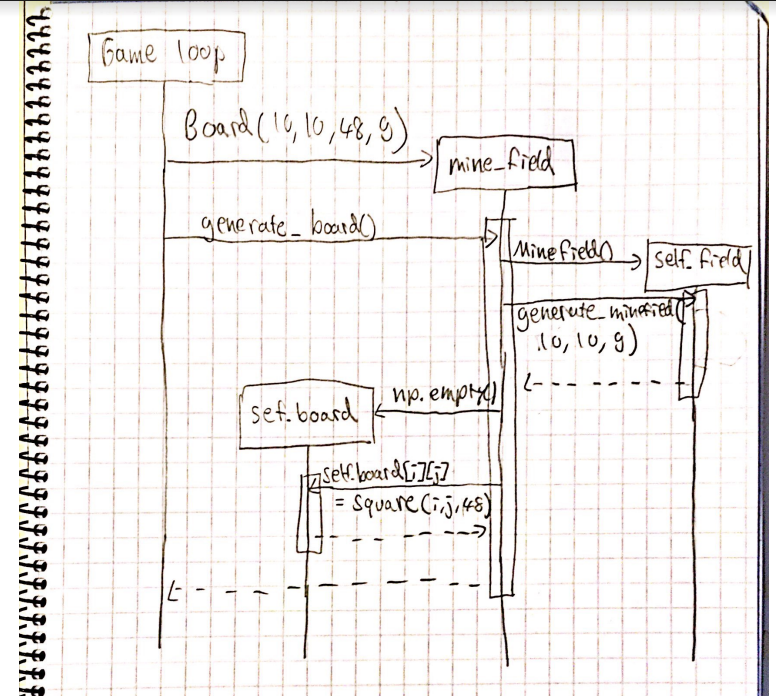

#Arkkitehtuurikuvaus

# Rakenne
Pakkausrakenne on seuraava:
- ui sisältää game loopin ja käyttöliittymään liittyviä asioita
- logic sisältää sovelluslogiikan, eli luokat Minefield, Square ja Board
- sheets_api sisältää yhteyden google sheetsiin ja funktion jolla tulokset lähetetään sinne

## Käyttöliittymä
Käyttöliittymä sisältää 4 erilaista näkymää:
- Main menu
- Pelin asetuksien menu
- Säätimet
- Varsinainen miinaharavapeli

Lisäksi käyttöliittymä sisältää Button luokan ja funktiota jotka piirtävät tekstiä ja ruutuja tietokoneruudulle.

Miinaharvapelillä on erillinen game looppi, muut näkymät ovat samassa loopissa. Näkymien välillä navigoidaan ruudulla olevien nappien avulla ja esc napin avulla. 

## Sovelluslogiikka

### Luokkakaavio
Minefield luokan ainoa tehtävä on generoida oikean kokoinen satunnainen miiharavakenttä ja sen arvot.

Square oliot sisältävät kaiken relevantin tiedon pelin ruudusta kuten sen arvon, jos en on paljastettu, tiedon graaffiesta esityksestä etc. Square olio toimii siltana käyttöliittymän ja sovelluslogiikan välillä.

Board olio on sovelluslogiikan master olio. Se sisältää kentän parametrin, pelin ruudut (Square oliot) ja kaikki sovelluslogiikan funktiot, jotka tarvitaan kun pelaaja klikkaa asioita käyttöliittymässä.

## Tuloksien talletus google shetsiin
Minulla on käytössä googlen api sheetsille ja driveille. Tämän ja pygsheets pakkauksen avulla miinaharvapelin high score lista toteutuu

## Päätoiminnalisuudet

### Miinaharvapelin kentän generointi
Kun uusi peli aloitetaan, niin satunnainen miinaharvakenttä generoidaan parametrien mukaan. Seuraava funktio edustaa kentää arrayna, jossa elementit ovat square olioita, jotka sisältävät kaiken relevantin tiedon ruudusta kuten sen arvon, jos en on paljastettu, tiedon graaffiesta esityksestä etc.

