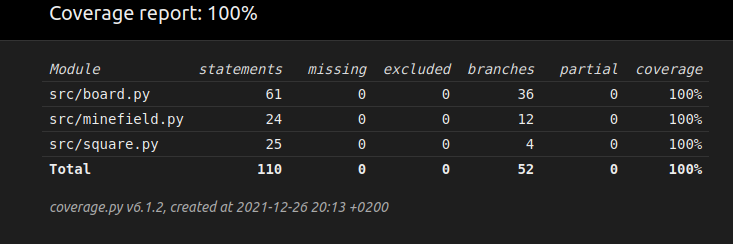

# Testikattavuus

## Yksikkö- ja integraatiotestaus
Ohjelmaa on testattu unittestin avulla

### Sovelluslogiikka
Sovelluslogiikan luokat Minefield, Square ja Board ovat testattu unittestin automatisoitujen testien avulla. Testit tarkistavat, että luokat ja niiden metodit toimivat kuten pitäisivät. Koska miinaharavakentät ovat satunnaiset, niin testauksessa käytetään random paketin random.seed() funktiota, jotta saadaan aina samanlainen kenttä testejä varten. Tällä varmistetaan, että sovelluslogiikka varsinkin toimii koska testit eivät mene läpi tuurilla.
Testit testaavat sovelluslogiikkaa perusteellisesti.

### Muu
Käyttöliittymälle ja pelin tuloksien lähetykselle google sheetsiin toiminnolle ei ole automatisoitua testausta.

### Testikattavuus
Haaraumakattavuus on 100%. Kaikille metodeille on testi, joka testaa jotain mielekästä.

## Järjestelmätestaus
Sovellusta on testattu manuaalisesti Linux koneella.

### Toiminnallisuudet
Kaikki pelin toiminnalisuudet on käyty läpi manuaalisesti ja on varmistettu, että ne toimivat oikein.
